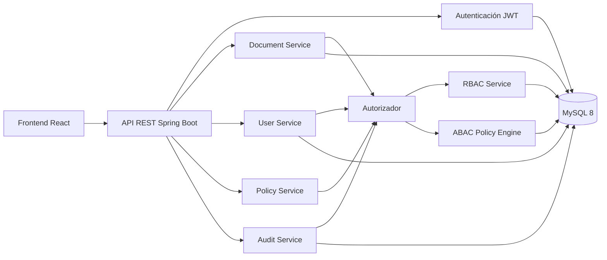
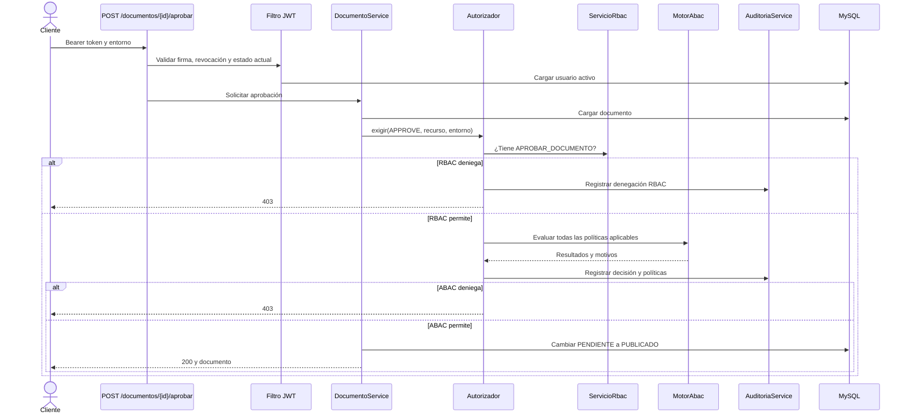
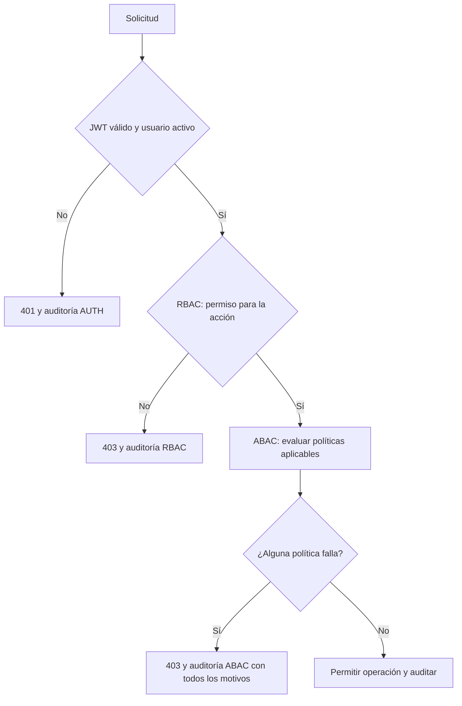

# Arquitectura de SecureDocs

La autenticación identifica al usuario. Cada operación protegida llega al `Autorizador`, que consulta permisos RBAC y, si el permiso existe, evalúa las reglas ABAC configuradas en MySQL. El resultado se registra en auditoría.

## Aprobación de un documento

## Flujo de decisión

Las cabeceras `X-Sim-*` solo se leen en el perfil `demo`. En perfiles normales, el entorno procede de la petición, del reloj configurado y de la IP observada. Consulta [auditoría](auditoria.md) para el formato de los eventos y [las matrices](matriz-rbac.md) para las autorizaciones iniciales.
