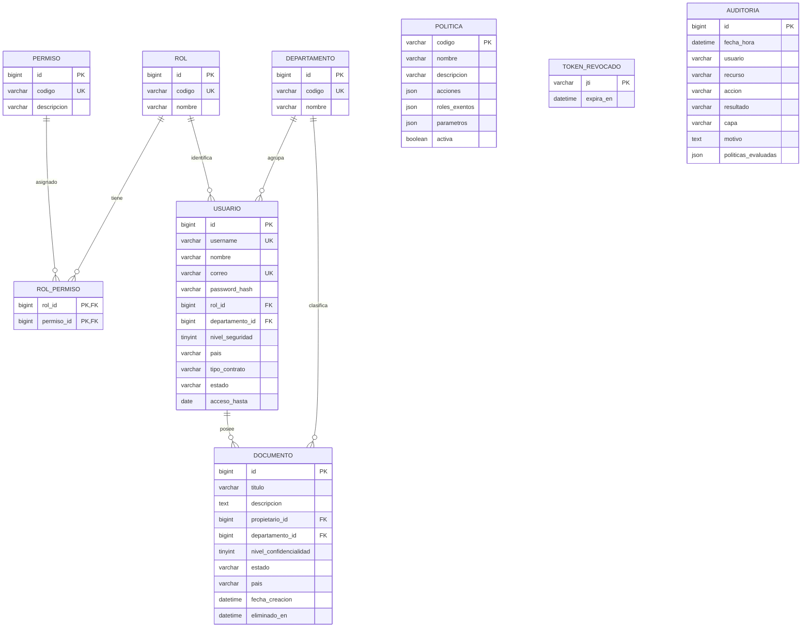

# Modelo de datos de SecureDocs

El modelo conserva los atributos mínimos de la guía y agrega soporte para revocación de tokens, políticas configurables y auditoría inmutable. Flyway es la fuente ejecutable del DDL: [esquema](../backend/src/main/resources/db/migration/V1__esquema.sql), [catálogos](../backend/src/main/resources/db/migration/V2__catalogos.sql) y [triggers de auditoría](../backend/src/main/resources/db/migration/V3__auditoria_append_only.sql). Las migraciones se aplican en ese orden y constituyen el DDL final de esta fase.

## Diccionario de datos

- **`rol` y `permiso`:** catálogos de los seis roles y las ocho operaciones obligatorias. `GESTIONAR_CONFIGURACION` es un permiso adicional de administración.
- **`rol_permiso`:** relación de muchos a muchos. Su clave compuesta evita duplicar una asignación.
- **`departamento`:** catálogo de áreas. Se referencia desde usuarios y documentos para comparar la política de departamento.
- **`usuario`:** identidad, hash BCrypt, rol, área y atributos ABAC. `acceso_hasta` solo se usa para invitados temporales. El hash nunca debe salir en respuestas de API.
- **`documento`:** recurso protegido. `propietario_id` identifica al creador; `eliminado_en` permite borrado lógico y conservación de auditoría.
- **`politica`:** alcance por acción, exenciones y parámetros en JSON. Cada código corresponde a una regla del motor ABAC.
- **`token_revocado`:** identificador `jti` de un JWT cerrado antes de su expiración.
- **`auditoria`:** copia de usuario, rol, departamento, contexto y decisión. No tiene claves foráneas para conservar la historia cuando cambien las entidades. Dos triggers rechazan `UPDATE` y `DELETE`.

Los niveles de usuario y documento están limitados por `CHECK` al rango de 0 a 5. Los índices de auditoría cubren fecha, usuario, recurso y resultado. `DataSeeder` carga los datos de prueba solamente con el perfil `demo`; los correos `@techcorp.example`, las descripciones neutras y la fecha fija son valores técnicos de demostración porque la guía no proporciona esos campos.
